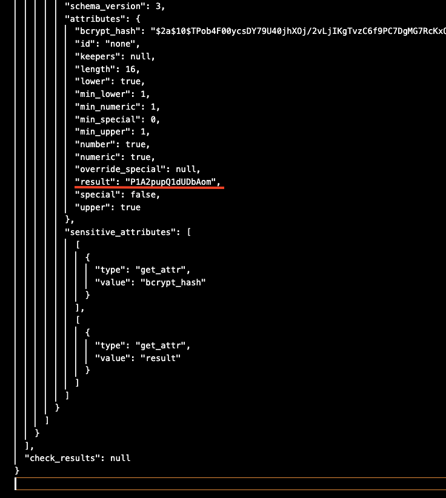
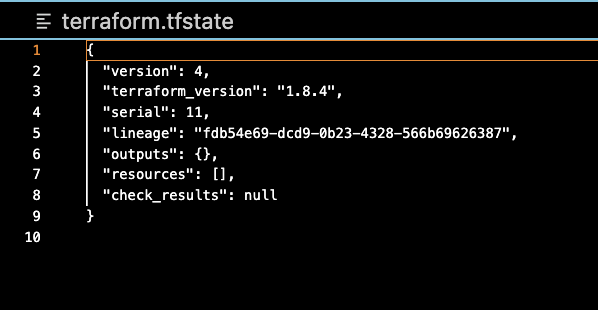

# home_work_terraform_1
*1 

terraform_version

*2 

result

*3

Ошибки которые были допущены: 
1) Название ресурса не может начинаться с цифры "1nginx"
2) name  = "example_${random_password.random_string_FAKE.resulT}" - тут опечатка "resulT", регистр букв очень важен. Так же здесь указан ресурс которого нету "random_string_FAKE"

*4

*5

Может привести к тому что, может полностью удалиться рабочий контур 

Пропускается момент с проверкой и если ты допустил ошибку в коде он просто выполниться с ошибкой без возможности что либо изменить 

Так же нужен для автоматизации в CI/CD

*5

keep_locally (логическое значение). Если true, образ Docker не будет удалён при операции уничтожения. Если false, образ будет удалён из локального хранилища Docker при операции уничтожения.

If true, then the image will be kept locally on destroy operation.

